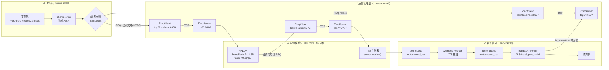

# LLM_Voice_Flow 通信架构精讲（四层视角 / 求职简历级）

> 对应仓库：<https://github.com/Yajoker/LLM_Voice_Flow>
> 本文按"接入层 / 通信管理层 / 边缘模型层 / 输出管道"四层结构，结合源码逐行讲解端侧离线智能语音交互系统的通信链路，并覆盖 Socket、IPC、ZMQ、RPC、序列化、背压、零拷贝等通信知识点，最后给出面试话术与高频追问。

---

# 第一部分：通信架构全景

## 1.1 三进程 + 三对 ZMQ + 一组内部双队列

整套系统由 **3 个独立进程** 组成（voice / llm / tts），它们之间用 **3 对 ZeroMQ REQ-REP** 串联起来；TTS 进程内部再用 **一组双 condition_variable 队列** 把"合成"和"播放"分成 pipeline 两段。

### Mermaid 架构图



### ASCII 简化图

```
+----------------+  6666 (REQ/REP, 文本)  +----------------+  7777 (REQ/REP, 句子)  +-------------------------+
|  voice (ASR)   | ---------------------> |   llm (RKLLM)  | ---------------------> |   tts (VITS + ALSA)     |
|  PortAudio+    |                        |  流式 token    |                        |  双队列pipeline+扬声器   |
|  sherpa-onnx   | <--------------------- |  回调切句      | <--------------------- |                         |
+----------------+ 6677 (REQ/REP, 播放完) +----------------+   "Echo: received"    +-------------------------+
```

## 1.2 每一层的组件 / 文件 / 协议 / 序列化对照表

| 层 | 组件 / 类 | 文件 / 行号 | 库 | 通信协议 | 序列化 |
|---|---|---|---|---|---|
| L1 接入层 | `RecordCallback`, `OnlineRecognizer` | `voice/sherpa-onnx/sherpa-onnx/voice/sherpa-onnx-microphone.cc:23,110` | PortAudio + sherpa-onnx | 本地 callback / 模型 API | float32 PCM 数组 |
| L2 通信管理层 | `ZmqInterface` / `ZmqClient` / `ZmqServer` | `zmq-comm-kit/include/Zmq*.h`，`zmq-comm-kit/src/Zmq*.cpp` | ZeroMQ (libzmq) | TCP + ZMQ REQ/REP | 裸 UTF-8 字符串 |
| L3 边缘模型层（LLM） | `Init`, `callback`, `receive_asr_data_and_process` | `llm/rknn-llm/examples/DeepSeek-R1-Distill-Qwen-1.5B_Demo/deploy/src/llm_demo.cpp:191,270,303` | RKLLM (NPU) | 同上 | UTF-8 文本片段 |
| L3 边缘模型层（TTS） | `TTSModel`, `synthesis_worker` | `tts/tts_server/src/main.cpp:17`，`tts/tts_server/src/TTSModel.cpp` | VITS / Eigen | 进程内函数调用 | 文本 → int16_t PCM |
| L4 输出管道 | `DoubleMessageQueue`, `playback_worker`, `AudioPlayer` | `tts/tts_server/src/MessageQueue.cpp`，`tts/tts_server/src/main.cpp:48`，`tts/tts_server/src/AudioPlayer.cpp` | std 线程库 + ALSA | mutex + condition_variable | `unique_ptr<int16_t[]>` 转移所有权 |

## 1.3 端到端走一遍：用户说话 → 听到回复

| 跳数 | 边界 | 数据形态 | 传输方式 |
|---|---|---|---|
| 1 | 麦克风 → PortAudio | 16 kHz float32 PCM 帧 | 内核 ALSA → PortAudio 回调 |
| 2 | PortAudio → sherpa-onnx | float32 PCM | 同进程内 `AcceptWaveform` |
| 3 | ASR → ZMQ REQ | UTF-8 字符串（句子） | `client.request(text)` (6666) |
| 4 | ZMQ → LLM 进程 | UTF-8 字符串 | TCP 之上的 ZMQ 消息 |
| 5 | LLM token 流回调 | UTF-8 token | RKLLM 回调函数 |
| 6 | LLM 切句 → ZMQ REQ | 单句 UTF-8 | `client.request(sentence)` (7777) |
| 7 | TTS 主线程 → 文本队列 | std::string | `queue.push_text(text)` |
| 8 | 合成线程 | int16_t PCM 数组 | VITS 推理 |
| 9 | 合成线程 → 音频队列 | `unique_ptr<int16_t[]>` | move 入队（零拷贝） |
| 10 | 播放线程 → ALSA | int16_t PCM | `snd_pcm_writei` |
| 11 | 播放完最后一段 → ZMQ REP | "play end success" | `status_server.send(...)` (6677) |
| 12 | voice 进程解锁麦克风 | 控制信号 | `block_client.request("block")` 返回 |

---

# 第二部分：四层逐层精讲

## L1 接入层 Access Layer

### (a) 对应源码

- 文件：`voice/sherpa-onnx/sherpa-onnx/voice/sherpa-onnx-microphone.cc`
- 关键符号：
  - `RecordCallback`（:23）—— PortAudio 实时回调
  - `main`（:70）—— 创建 ZMQ Client、起 ASR 流
  - 主循环 `while(!stop)`（:184）—— 端点检测、发请求

### (b) 关键源码逐行讲解

**麦克风回调**：

```23:38:voice/sherpa-onnx/sherpa-onnx/voice/sherpa-onnx-microphone.cc
static int32_t RecordCallback(const void *input_buffer,
                              void * /*output_buffer*/,
                              unsigned long frames_per_buffer,
                              const PaStreamCallbackTimeInfo * /*time_info*/,
                              PaStreamCallbackFlags /*status_flags*/,
                              void *user_data) {
  if (!wait) {
    auto stream = reinterpret_cast<sherpa_onnx::OnlineStream *>(user_data);
    stream->AcceptWaveform(mic_sample_rate,
                           reinterpret_cast<const float *>(input_buffer),
                           frames_per_buffer);
  }
  return stop ? paComplete : paContinue;
}
```

- 这个函数**不是你主动调的**，是 PortAudio 的实时音频线程在驱动到来时回调你。
- `wait` 是个全局 `bool`，表示"现在 TTS 正在说话，麦克风别采"——经典"半双工"控制。
- `AcceptWaveform` 把一小段 PCM 直接喂给 sherpa-onnx 的 ASR 流。

**两个 ZMQ 客户端**：

```72:73:voice/sherpa-onnx/sherpa-onnx/voice/sherpa-onnx-microphone.cc
  zmq_component::ZmqClient client;
  zmq_component::ZmqClient block_client("tcp://localhost:6677");
```

- 默认构造连 `tcp://localhost:6666`（去 LLM 进程）。
- `block_client` 连 `tcp://localhost:6677`（去 TTS 进程的 status_server）。

**主循环里的端点检测与同步收发**：

```212:227:voice/sherpa-onnx/sherpa-onnx/voice/sherpa-onnx-microphone.cc
    if (is_endpoint) {
      if (!text.empty()) {
        auto response = client.request(text);
        std::cout << "[llm -> voice] received: " << response << std::endl;

        wait = true;
        auto block_response = block_client.request("block");
        std::cout << "[tts -> voice] received: " << block_response << std::endl;
        wait = false;

        ++segment_index;
      }
      recognizer.Reset(s.get());
    }
```

- `client.request(text)`：同步把识别文本发给 LLM，并等 LLM 回 `"llm sucess reply !!!"`。
- `block_client.request("block")`：紧接着发给 TTS，**直到 TTS 把这一轮所有音频播完才返回**——这就是"一问一答"的同步原语。
- `wait` 在收发前后翻转，避免 TTS 说话期间收录自己的声音（声学回环）。

### (c) 通信范式

- 麦克风 → ASR：**事件驱动 + 回调**（PortAudio 的实时线程）。
- ASR → 下游：**同步阻塞 RPC**（ZMQ REQ/REP）。
- 整体单线程主循环 + 一个 PortAudio 内部线程。

### (d) 并发模型

- 主线程：跑 ASR 解码 + ZMQ 收发。
- PortAudio 内部线程：跑 `RecordCallback`。
- 共享变量：`stop`、`wait`、ASR Stream 指针。**没有显式加锁**——靠的是"PortAudio 回调里只写 stream，主线程只读 result"这种"半冲突"约定，并不严格安全（理论上 `wait` 应该是 `std::atomic<bool>`）。

### (e) 输入 / 输出

- 输入：`float32` PCM（16 kHz mono）。
- 输出：UTF-8 文本字符串。
- 序列化：直接 `std::string` 当成字节扔进 ZMQ message。

### (f) 难点 / 易踩坑点

- 半双工的 `wait` 不是原子变量——**面试地雷**。
- 没有热词、没有 VAD 抢断（用户没法打断 AI），交互体验有限。
- `Pa_Sleep(20)` 轮询式拿结果，理论上可以改成条件变量更省 CPU。

### (g) 替代实现

- ZMQ REQ/REP → **WebSocket / SSE**：方便接 Web 前端。
- 把 ASR 单独抽成 server 进程、麦克风进程做 client：解耦更彻底，但跨进程传 PCM 开销变大。

---

## L2 通信管理层 Communication Management Layer

### (a) 对应源码

- 头文件：`zmq-comm-kit/include/ZmqInterface.h`、`ZmqClient.h`、`ZmqServer.h`
- 源文件：`zmq-comm-kit/src/Zmq*.cpp`
- 测试：`zmq-comm-kit/test/demo.cpp`
- 编译产物：`/usr/local/lib/libzmq_component.so`（被三个业务进程 link）

### (b) 关键源码逐行讲解

**基类 ZmqInterface（核心）**：

```7:27:zmq-comm-kit/include/ZmqInterface.h
namespace zmq_component {

class ZmqCommunicationError : public std::runtime_error {
public:
    explicit ZmqCommunicationError(const std::string& what);
};

class ZmqInterface {
protected:
    std::unique_ptr<zmq::context_t> context_;
    std::unique_ptr<zmq::socket_t> socket_;
    int timeout_ms_ = -1;

    void setupSocket(int socket_type, const std::string& address);

public:
    virtual ~ZmqInterface();
    void setTimeout(int milliseconds);
};
```

- `context_t`：ZMQ "上下文"，里面有 I/O 线程池，**每个进程通常只建一个**。
- `socket_t`：是 ZMQ 的"高级 socket"，**不是 BSD socket**——它支持自动重连、自动分帧。
- 默认 `timeout_ms_ = -1` 表示**无限阻塞**。

**setup 函数**：

```8:21:zmq-comm-kit/src/ZmqInterface.cpp
void ZmqInterface::setupSocket(int socket_type, const std::string& address) {
    try {
        context_ = std::make_unique<zmq::context_t>(1);
        socket_ = std::make_unique<zmq::socket_t>(*context_, socket_type);

        socket_->set(zmq::sockopt::rcvtimeo, timeout_ms_);
        socket_->set(zmq::sockopt::sndtimeo, timeout_ms_);

        (socket_type == ZMQ_REP) ? socket_->bind(address)
                                  : socket_->connect(address);
    } catch (const zmq::error_t& e) {
        throw ZmqCommunicationError(e.what());
    }
}
```

- `zmq::context_t(1)`：1 个 I/O 线程，适合低 QPS。
- 设置收发超时（即使没设置 setTimeout 调用，这里也写了 `-1`，等价于不限）。
- REP socket 一定 `bind`（服务端），其余 `connect`（客户端）。

**客户端 send/recv（同步语义）**：

```9:23:zmq-comm-kit/src/ZmqClient.cpp
void ZmqClient::sendRequest(const std::string& message) {
    zmq::message_t request(message.size());
    memcpy(request.data(), message.data(), message.size());
    if (!socket_->send(request, zmq::send_flags::none)) {
        throw ZmqCommunicationError("Send timeout");
    }
}

std::string ZmqClient::receiveResponse() {
    zmq::message_t reply;
    if (!socket_->recv(reply)) {
        throw ZmqCommunicationError("Receive timeout");
    }
    return {static_cast<char*>(reply.data()), reply.size()};
}
```

- `zmq::message_t` 是 ZMQ 的零拷贝消息容器，但这里用了 `memcpy`——**应用层做了一次拷贝**，未来可优化。
- `send_flags::none` 是阻塞发送；非阻塞可以传 `dontwait`。

**`request()` 一行打包同步 RPC 语义**：

```25:28:zmq-comm-kit/src/ZmqClient.cpp
std::string ZmqClient::request(const std::string& message) {
    sendRequest(message);
    return receiveResponse();
}
```

这就是项目里 voice→llm、llm→tts、voice→tts 三处所有调用的本质：一个**裸字符串的同步 RPC**。

### (c) 通信范式

- ZMQ REQ/REP：**同步、严格状态机**（send→recv 必须交替）。
- 没用 PUB/SUB / DEALER/ROUTER / PUSH/PULL——简单粗暴，胜在好懂、好调。

### (d) 并发模型

- ZMQ context 自带 1 个 I/O 线程，**所有 send/recv 都从业务线程跨到 I/O 线程异步执行**，但 REQ/REP 的 API 是同步的，所以从业务线程看就是阻塞调用。
- **socket 不是线程安全的**——一个 socket 同一时刻只能在一个线程用，这是 ZMQ 的硬约定。

### (e) 输入 / 输出 + 序列化

- 输入输出都是 `std::string`，**裸字节传输**，无序列化协议。
- 优点：简单到极致。缺点：未来扩字段就要靠"魔法字符串"（项目里就有 `"END"`、`"block"`、`"play end success"`），可读性差、不可演进。

### (f) 难点 / 易踩坑点

- REQ 死锁：对端不回包就一直卡。建议用 `setTimeout` 设几秒。
- `context_t` 在多线程进程里**只建一个**，业务里建多个 ZmqClient 共用 context 更省资源——本项目每个 client 独立 context，**面试时可以指出来作为优化点**。
- socket 跨线程：项目里 ZmqClient 都在主线程用，没问题；如果在多线程用要靠 inproc 转发或 socket-per-thread。

### (g) 替代实现

| 方案 | 优点 | 缺点 |
|---|---|---|
| 本项目（ZMQ REQ/REP + 裸字符串） | 极简、依赖小 | 无 schema、无 backpressure、无重试 |
| gRPC + Protobuf | 强类型、流式、跨语言 | 依赖重、编译产物大 |
| ZMQ DEALER/ROUTER + Protobuf | 异步、可路由、能并发 | 自己实现一层 RPC 框架 |
| Unix Domain Socket + 自研协议 | 同机性能最高 | 不能跨机、调试麻烦 |
| HTTP/REST | 工具链最丰富 | 单连接吞吐低 |

---

## L3 边缘模型层 Edge Model Layer

> 这一层包含两个独立进程：**llm 进程**（RKLLM + DeepSeek-R1）、**tts 进程**（VITS + ALSA）。

### L3-A LLM 进程

#### (a) 文件 / 类 / 函数

- 真实运行入口：`llm/rknn-llm/examples/DeepSeek-R1-Distill-Qwen-1.5B_Demo/deploy/src/llm_demo.cpp`
- 简化测试入口（不带模型，纯转发）：`llm/test/llm_test.cpp`
- 关键函数：`Init`(:270)、`callback`(:191)、`receive_asr_data_and_process`(:303)

#### (b) 关键源码

**进程入口同时建一个 ZMQ Server 和一个 ZMQ Client**（典型的"既是服务端又是客户端"）：

```35:36:llm/rknn-llm/examples/DeepSeek-R1-Distill-Qwen-1.5B_Demo/deploy/src/llm_demo.cpp
zmq_component::ZmqServer server;
zmq_component::ZmqClient client("tcp://localhost:7777");
```

**主循环：阻塞等 ASR 文本，立刻 ACK，再喂给模型**：

```303:327:llm/rknn-llm/examples/DeepSeek-R1-Distill-Qwen-1.5B_Demo/deploy/src/llm_demo.cpp
void receive_asr_data_and_process()
{
    RKLLMInferParam rkllm_infer_params;
    memset(&rkllm_infer_params, 0, sizeof(RKLLMInferParam));
    rkllm_infer_params.mode = RKLLM_INFER_GENERATE;
    rkllm_infer_params.keep_history = 0;
    rkllm_set_chat_template(llmHandle, "", "<｜User｜>", "<｜Assistant｜>");

    RKLLMInput rkllm_input;

    while (true)
    {
        std::string input_str;
        rkllm_input.input_type = RKLLM_INPUT_PROMPT;
        input_str = server.receive();
        std::cout << "[voice -> llm] received: " << input_str << std::endl;
        server.send("llm sucess reply !!!");
        rkllm_input.prompt_input = (char *)input_str.c_str();
        rkllm_run(llmHandle, &rkllm_input, &rkllm_infer_params, NULL);
    }
}
```

- `server.receive()` 阻塞收 ASR 句子。
- **先 ACK 再推理**：让 voice 端的 REQ 立刻拿到回包，避免 voice 端卡住。
- `rkllm_run` 是同步入口，但内部会**异步回调** `callback`。

**回调里按中文标点切句、立刻流式推 TTS**（项目的"流式核心"）：

```191:268:llm/rknn-llm/examples/DeepSeek-R1-Distill-Qwen-1.5B_Demo/deploy/src/llm_demo.cpp
void callback(RKLLMResult *result, void *userdata, LLMCallState state)
{
    if (state == RKLLM_RUN_FINISH)
    {
        if (!buffer_.empty())
        {
            std::string response_str = wstring_to_utf8(extract_after_think(buffer_)) + " END";
            auto response = client.request(response_str);
            buffer_.clear();
        }
        else
        {
            auto response = client.request("END");
        }
    }
    else if (state == RKLLM_RUN_NORMAL)
    {
        std::wstring wide_text = utf8_to_wstring(result->text);
        for (wchar_t c : wide_text) {
            buffer_ += c;
            if (split_chars.count(c)) {
                if (!buffer_.empty()) {
                    send_response(buffer_);
                    buffer_.clear();
                }
            }
        }
    }
}
```

- `split_chars` = `{：, ，, 。, \n, ；, ！, ？}`，遇到这些字符就当成一个语义单元结束。
- 每出一句就 `client.request(...)` 同步发给 TTS，**等 TTS 当场 ACK 后再继续往下生成 token**。
- 最后一段 `RUN_FINISH` 时把残余 buffer 加上 `" END"` 发出，作为本轮对话的"结束标记"。

#### (c) 通信范式

- 模型推理：同步触发、**异步流式回调**（RKLLM 内部跑在自己的线程上）。
- LLM → TTS：**同步 REQ/REP**，构成"边产边消费"的流水线。

#### (d) 并发模型

- 主线程：阻塞在 `server.receive()` / `rkllm_run`。
- RKLLM 内部推理线程：每生成一段 token 调一次 `callback`。
- **callback 和主线程共享 `buffer_` / `client`**——`buffer_` 是 wstring，`client` 是 ZmqClient；这里**没有加锁**。理论上 callback 只在一个内部线程里被调用，主线程在 callback 期间也只是阻塞等 rkllm_run 返回，所以**没有真正并发写**，但 buffer 跨调用累计的语义靠的是"同一个回调线程多次调用"这种隐式假设。

#### (e) 输入 / 输出 + 序列化

- 输入：UTF-8 prompt 字符串。
- 输出：UTF-8 句子片段 + 控制标记 `"END"`。
- 中间用 `std::wstring` 处理是为了**安全切割中文**（标点是 wchar_t）。

#### (f) 难点 / 易踩坑点 / 优化方向

- `<think>` 思维链是**跨多次回调**的，一段文本里可能只包含一半的 `</think>`。`extract_after_think` 在 LLM 端做了，但**只在 RUN_FINISH 时统一处理**——流式过程中 think 内容可能已经发出去并被 TTS 误读。**这是一个真实存在的 bug，面试时主动指出能加分。**
- **回调里做阻塞 ZMQ 是危险的**：如果 TTS 来不及消费、回包慢，**会把 LLM 推理线程也卡住**——典型背压传导。可以在 LLM 端加一个小线程池或异步队列做"发射后不管"。
- **首段延迟**：流式分句 + 句级 TTS，"听到第一句"延迟 ≈ ASR 端点 + LLM 第一句 token 完成 + TTS 第一段合成。每一步都可以再切小（如按短语切句而非整句）。

#### (g) 换种实现

- LLM 输出换成 **gRPC server-streaming**：一个 RPC 内部就能 `stream` 多次响应，**和回调天然契合**；缺点是依赖大。
- TTS 改成 **流式 TTS**（按 mel 帧而不是按句子产出 PCM）：可以进一步降首段延迟，但模型本身要支持流式 vocoder。
- 用 **共享内存 + 信号量** 把 LLM 进程和 TTS 进程合二为一：性能更好，但失去模块化和独立崩溃隔离。

### L3-B TTS 进程（仅讲通信相关）

```13:14:tts/tts_server/src/main.cpp
zmq_component::ZmqServer server("tcp://*:7777");
zmq_component::ZmqServer status_server("tcp://*:6677");
```

主循环（负责接收 LLM 推过来的文本片段 → 推入文本队列）：

```76:92:tts/tts_server/src/main.cpp
        while (true) {
            if (first_msg) {
                std::string req = status_server.receive();
                std::cout << "[voice -> tts] received: " << req << std::endl;
            }
            first_msg = false;

            std::string text = server.receive();
            server.send("Echo: received");
            std::cout << "[llm -> tts] received: " << text << std::endl;

            if (!text.empty() && text.find("<think>") == std::string::npos) {
                queue.push_text(text);
            }
        }
```

- `first_msg` 控制"是否要先等 voice 来的 'block' 才开始接 LLM"——保证"一轮对话"边界。
- `server.send("Echo: received")` 是**同步背压点**：LLM 的 `client.request(...)` 卡在这里等回包。

---

## L4 模型输出管道 Output Pipeline

### (a) 文件 / 类

- `tts/tts_server/include/MessageQueue.h`（结构体 `AudioMessage` + 类 `DoubleMessageQueue`）
- `tts/tts_server/src/MessageQueue.cpp`（实现）
- `tts/tts_server/src/main.cpp`：`synthesis_worker`(:17)、`playback_worker`(:48)、回流信号 `status_server.send(...)`(:56)
- ALSA 播放：`tts/tts_server/src/AudioPlayer.cpp`

### (b) 关键源码

数据结构：

```11:37:tts/tts_server/include/MessageQueue.h
struct AudioMessage {
    std::unique_ptr<int16_t[]> data;
    size_t length;
    bool is_last = false;
};

class DoubleMessageQueue {
public:
    void push_text(const std::string &msg);
    std::string pop_text();

    void push_audio(std::unique_ptr<int16_t[]> data, size_t length, bool is_last = false);
    AudioMessage pop_audio();

    void stop();

private:
    std::queue<std::string> text_queue_;
    std::mutex text_mutex_;
    std::condition_variable text_cond_;

    std::queue<AudioMessage> audio_queue_;
    std::mutex audio_mutex_;
    std::condition_variable audio_cond_;

    std::atomic<bool> stop_{false};
};
```

**这是 C++ 教科书式的"线程安全队列"**。`unique_ptr` 用来转移 PCM 缓冲的所有权——同进程内只传指针，应用层零拷贝。

实现：

```3:48:tts/tts_server/src/MessageQueue.cpp
void DoubleMessageQueue::push_text(const std::string &msg)
{
    {
        std::lock_guard<std::mutex> lock(text_mutex_);
        text_queue_.push(msg);
    }
    text_cond_.notify_one();
}

std::string DoubleMessageQueue::pop_text()
{
    std::unique_lock<std::mutex> lock(text_mutex_);
    text_cond_.wait(lock, [this]
                    { return !text_queue_.empty() || stop_; });

    if (stop_)
        return "";

    std::string msg = std::move(text_queue_.front());
    text_queue_.pop();
    return msg;
}

void DoubleMessageQueue::push_audio(std::unique_ptr<int16_t[]> data, size_t length, bool is_last)
{
    AudioMessage msg{std::move(data), length, is_last};
    {
        std::lock_guard<std::mutex> lock(audio_mutex_);
        audio_queue_.push(std::move(msg));
    }
    audio_cond_.notify_one();
}

AudioMessage DoubleMessageQueue::pop_audio()
{
    std::unique_lock<std::mutex> lock(audio_mutex_);
    audio_cond_.wait(lock, [this]
                     { return !audio_queue_.empty() || stop_; });

    if (stop_)
        return {nullptr, 0, true};

    AudioMessage msg = std::move(audio_queue_.front());
    audio_queue_.pop();
    return msg;
}
```

逐行讲解（面试热点）：
- `push_text` 用 `lock_guard` 在花括号里加锁、入队，**出花括号就解锁**，**再 `notify_one`**——这种"锁外通知"是经典优化：消费者被唤醒时锁已释放，立刻能拿到锁，减少"两次抢锁"开销。
- `pop_text` 用 `unique_lock`（因为 `wait` 内部需要先解锁再加锁，必须用 `unique_lock`）。
- `cond.wait(lock, predicate)` 的 **predicate** 是**防止"假唤醒"和"`notify_all` 时多消费者抢同一个 item"的关键**。
- `stop_` 是 `std::atomic<bool>`，用在 predicate 里**让所有阻塞线程在停服时退出**，避免线程永远卡在 `wait`。
- 用 `std::move(text_queue_.front())` 而不是拷贝——对 string/unique_ptr 都是必要的零拷贝。

合成线程（消费 text_queue，生产 audio_queue）：

```17:46:tts/tts_server/src/main.cpp
void synthesis_worker(DoubleMessageQueue &queue, TTSModel &model) {
    while (true) {
        std::string text = queue.pop_text();
        if (text.empty()) break;

        if (text.find("END") != std::string::npos) {
            first_msg = true;
            size_t end_pos = text.find("END");
            text = text.substr(0, end_pos);
        }

        int32_t audio_len = 0;
        if (!text.empty()) {
            std::cout << "[TTS infer] Inferring text: " << text << std::endl;
            int16_t* wavData = model.infer(text, audio_len);

            if (wavData && audio_len > 0) {
                auto audio_data = std::make_unique<int16_t[]>(audio_len);
                memcpy(audio_data.get(), wavData, audio_len * sizeof(int16_t));
                queue.push_audio(std::move(audio_data), audio_len, first_msg);
                model.free_data(wavData);
            }
        } else {
            auto empty_audio = std::make_unique<int16_t[]>(0);
            queue.push_audio(std::move(empty_audio), 0, first_msg);
        }
    }
}
```

注意 `first_msg` 的语义被复用为 `AudioMessage::is_last`（命名 misleading：实际意思是"这一轮对话的尾段标记"）。

播放线程：

```48:59:tts/tts_server/src/main.cpp
void playback_worker(DoubleMessageQueue &queue, AudioPlayer &player) {
    while (true) {
        auto msg = queue.pop_audio();
        if (msg.data == nullptr) break;

        player.play(msg.data.get(), msg.length * sizeof(int16_t), 1.0f);

        if (msg.is_last) {
            status_server.send("[tts -> voice]play end success");
        }
    }
}
```

精华就是最后两行——**音频播放完了，才发回流信号给 6677**，从而解锁 voice 进程的 `block_client.request("block")`。

ALSA 播放细节：

```30:76:tts/tts_server/src/AudioPlayer.cpp
void AudioPlayer::play(const int16_t *audioData, int audio_len, float speed)
{
    ...
    int err = snd_pcm_set_params(pcm_handle_,
                                 SND_PCM_FORMAT_S16_LE,
                                 SND_PCM_ACCESS_RW_INTERLEAVED,
                                 1,
                                 sample_rate,
                                 1,
                                 50000);
    ...
    while (true)
    {
        err = snd_pcm_writei(pcm_handle_, audioData, frames);
        if (err == -EPIPE)
        {
            if (++retry_count >= max_retries)
                break;
            snd_pcm_prepare(pcm_handle_);
        }
        ...
    }

    if (snd_pcm_state(pcm_handle_) == SND_PCM_STATE_RUNNING)
    {
        snd_pcm_drain(pcm_handle_);
    }
}
```

- `SND_PCM_FORMAT_S16_LE` = 16-bit 小端 PCM。
- `snd_pcm_writei` 是**阻塞写**，缓冲区满则等。
- `-EPIPE` 是 **buffer underrun**（缓冲区欠载），用 `snd_pcm_prepare` 恢复 + 重试 3 次——这就是 ALSA 层面的"重传"。
- `snd_pcm_drain` 等待已缓冲数据全部播放完，**这一行让 `is_last` 真的"听完才回信号"**。

### (c) 通信范式

- 进程内：**生产者-消费者管道**（mutex + cond_var）。
- 双队列：**解耦不同速率的阶段**（TTS 推理慢、ALSA 播放快），互不阻塞。
- 反向回流：通过 ZMQ REP（6677）告诉 voice "播完了"。

### (d) 并发模型

- 主线程：阻塞在 `server.receive()`（7777，文本输入）。
- synthesis 线程：阻塞在 `pop_text`。
- playback 线程：阻塞在 `pop_audio` 或 ALSA `snd_pcm_writei`。
- 三者**两两通过 condition_variable 串联**，形成 pipeline。

### (e) 输入/输出 + 序列化

进程内**不序列化**。
关键所有权转移：`unique_ptr<int16_t[]>` `std::move` 进队列、`std::move` 出队列——**整段 PCM 内存只 malloc 一次、free 一次**，是 C++11 "move semantics" 的教科书示例。

### (f) 难点 / 坑点 / 优化方向

- **背压**：当前队列**无界**，如果 TTS 比播放慢，audio_queue 还好（自然限流）；但如果 LLM 比 TTS 快，text_queue 会无限增长——**典型缺失背压**。优化：换 bounded queue，push 时 wait。
- **`is_last` 语义被复用为 first_msg**：变量命名混乱；面试时如果被问到，要诚实承认"这是项目里命名不够好的地方"。
- **`break` 退出依赖 `text.empty()`**：但 `pop_text` 在 `stop_` 时返回 `""`，在正常情况下也可能空（极少），有歧义。

### (g) 换种实现

- 用 **lock-free SPSC 队列**（如 `boost::lockfree::spsc_queue`、moodycamel）：text/audio 都是单生产者-单消费者，**完美场景**。
- 用 **`std::promise/future`**：适合"一发一收"，不适合流式。
- 用 **共享内存 + 环形缓冲**（如 `mmap` + atomic 索引）：跨进程也可零拷贝。这是音视频领域常见做法。

---

# 第三部分：通信知识点科普卡片

> 每张卡片格式：是什么 / 为什么用 / 怎么用（最小示例）/ 项目里的具体用例 / 替代品 / 面试题。

## 卡片 1：Socket 基础（TCP / UDP / UDS）

- **是什么**：socket 是操作系统给应用提供的"网络收发口"。TCP 是"打了电话的可靠字节流"，UDP 是"扔进邮筒的数据报"，Unix Domain Socket(UDS) 是"通过文件路径在同机进程间打电话的 socket"。
- **为什么用**：TCP 给你可靠、顺序、流量控制，适合长连接业务；UDP 低延迟、可丢，适合音视频流和游戏；UDS 比 TCP 快（不走网卡、不算校验和），适合本机进程间。
- **最小示例**：
```cpp
int s = socket(AF_INET, SOCK_STREAM, 0);
sockaddr_in addr{AF_INET, htons(6666), {INADDR_LOOPBACK}};
connect(s, (sockaddr*)&addr, sizeof(addr));
send(s, "hello", 5, 0);
```
- **本项目用例**：ZMQ 的 `tcp://localhost:6666/7777/6677` 底层就是 BSD TCP socket；如果改成 `ipc:///tmp/foo.sock` 就是 UDS。
- **替代品**：QUIC（UDP 之上的可靠/有序流，HTTP/3 底层）。
- **面试题**：TCP 粘包/半包为何存在？UDS 为什么比 TCP 快？

## 卡片 2：IPC（进程间通信）

- **是什么**：同机两个进程间交换数据的所有手段，包含：管道(pipe/FIFO)、消息队列(`mq_*`)、共享内存(`shm_*` / `mmap`)、信号量、socket（含 UDS）、信号(signal)、`eventfd`。
- **为什么用**：进程隔离 + 数据共享。
- **典型对比**：
  - pipe/FIFO：**单向字节流**，简单；写满会阻塞。
  - 共享内存：**最快**，但要自己同步（mutex/sema）。
  - 消息队列：内核维护、带优先级，但 size 有限制。
  - UDS：和 socket 编程接口一致，方便。
- **本项目用例**：**没有用原生 IPC**，但概念上"voice/llm/tts 三进程通过 ZMQ 互通"就是 IPC——只是用的网络栈而非内核 IPC。**ALSA 内部** 用的是 ioctl + 内核 ring buffer，是"用户态 ↔ 内核态"的特殊 IPC。
- **替代品**：D-Bus（桌面环境常用）、Android Binder。
- **面试题**：mmap 共享内存怎么同步？为什么 pipe 是单向的？

## 卡片 3：ZeroMQ（ZMQ）

- **是什么**：一个"带智能的 socket 库"，提供面向消息（不是字节流）的通信原语，支持多种网络/IPC 传输（tcp、ipc、inproc、pgm）。ZMQ **没有 broker（默认），但有 broker-able 拓扑**。
- **和原生 socket 的区别**：自动重连、自动分帧（消息边界）、内置异步 I/O 线程、内置常用通信模式。
- **和 RabbitMQ/Kafka 的区别**：MQ 是带持久化的**集中式 broker**；ZMQ 是**库**，不持久化，进程崩溃数据可能丢。
- **常见 socket 类型（必背）**：
  - `REQ/REP`：同步请求-响应。一来一回，状态机严格。
  - `PUSH/PULL`：单向流水线，PUSH 负载均衡到多个 PULL。
  - `PUB/SUB`：广播订阅，**慢订阅者会被丢弃消息**（默认）。
  - `DEALER/ROUTER`：高级版的 REQ/REP，**异步、双向、可路由**，做自研 RPC 的基石。
- **为什么边缘 AI 项目喜欢 ZMQ**：依赖小（一个 `.so`）、模式丰富、跨语言、单机/跨机一行代码切换（`tcp://` ↔ `ipc://`）。
- **本项目用例**：3 对 REQ/REP（端口 6666 / 7777 / 6677）。
- **面试高频问题**：
  - REQ/REP 死锁怎么破？答：换 DEALER，或加超时 + socket 重建。
  - PUB/SUB 会丢消息吗？答：会，慢订阅者高水位被丢弃；可以加大 HWM、或换 PUSH/PULL/带 broker 的 MQ。

## 卡片 4：RPC（远程过程调用）

- **是什么**：让你"像调本地函数一样调远端进程的函数"。本质 = 序列化参数 + 网络传输 + 远端反序列化执行 + 序列化结果 + 回传。
- **和 HTTP API 的区别**：HTTP API 是"约定 URL + JSON"，松散；RPC 通常**带 IDL（接口定义语言）**，强类型、自动生成 stub。
- **和消息队列的区别**：RPC 是**同步、点对点、有返回值**；MQ 是**异步、解耦、不一定有返回值**。
- **常见框架**：gRPC（Google，HTTP/2 + Protobuf）、Thrift（Facebook）、bRPC（百度，高性能 C++）、Apache Dubbo（Java）。
- **同步 vs 流式 vs 异步**：gRPC 支持 4 种：unary、server-stream、client-stream、bidi-stream。**LLM token 流是 server-stream 的典型场景**。
- **本项目用例**：**没用 gRPC**，作者自己用 ZMQ REQ/REP 实现了"轻量级 RPC"——这是面试可以回答的差异点。
- **面试题**：为什么 RPC 常和 Protobuf 搭配？答：Protobuf 序列化快、二进制紧凑、IDL 自动生成 stub 代码。

## 卡片 5：HTTP / WebSocket / SSE

- **HTTP**：请求-响应、短连接（HTTP/1.1 起支持 keep-alive）、文本/二进制，REST API 标配。
- **WebSocket**：HTTP 升级而来，**全双工长连接**，适合双向消息（聊天、游戏）。
- **SSE (Server-Sent Events)**：基于 HTTP 的**单向服务端推流**，浏览器 EventSource API 原生支持，**流式 ChatGPT 用的就是 SSE**。
- **流式 LLM 输出常用哪个？** SSE（简单、HTTP-friendly）或 gRPC server-stream（强类型、跨语言）。WebSocket 也行但是双向，对纯下行 token 流是"杀鸡用牛刀"。
- **本项目用例**：都没用，直接 ZMQ。但你简历可以写"理解三者差异，本项目选 ZMQ 是因为端侧无 Web 上下游"。

## 卡片 6：序列化协议

| 协议 | 编码 | 自描述 | 性能 | 适用 |
|---|---|---|---|---|
| JSON | 文本 | 是 | 低 | 调试友好、Web API |
| Protobuf | 二进制 | 否（需 .proto） | 高 | RPC、强类型 |
| FlatBuffers | 二进制 | 否 | 极高（零拷贝读） | 游戏、移动端 |
| MessagePack | 二进制 | 是 | 中高 | "二进制版 JSON" |
| 裸字节 | 二进制 | 否 | 最高 | 私有协议 |

- **本项目用例**：**裸字节**，靠 magic string 区分语义（`"block"`、`"END"`、`"play end success"`）。面试时主动指出"如果业务增长会被字段爆炸打脸"。

## 卡片 7：消息中间件 vs ZMQ

- **Kafka**：高吞吐**日志型 MQ**，分区+多副本+持久化，适合大数据流。
- **RabbitMQ**：经典 AMQP MQ，路由灵活，适合企业应用。
- **NATS**：轻量级、低延迟、Cloud Native。
- **Redis Stream**：用 Redis 做轻量 MQ。
- **ZMQ**：**库**，没 broker、没持久化、没强一致；它定位是"socket 的高级原语"，不和上面这些直接对标。
- **面试题**："ZMQ 是 MQ 吗？" 严格说**不是**，它是消息库，不是消息中间件。

## 卡片 8：事件驱动 / Reactor 模型

- **是什么**：用一个"事件循环"（event loop）监听很多 fd（socket、timer、pipe），哪个就绪就回调哪个的处理函数。**核心是 `epoll`/`kqueue`/`IOCP`**——内核多路复用 API。
  - `epoll`（Linux）、`kqueue`（macOS/BSD）、`IOCP`（Windows）。
- **库**：libevent、libev、libuv（Node.js 底层）、boost.asio、folly、muduo。
- **大白话**：以前每来一个连接开一个线程（`thread-per-connection`），1 万个连接 1 万个线程——崩。Reactor 是一个线程管所有连接，**只在有事件时唤醒**。
- **本项目用例**：ZMQ 内部就是 reactor（基于 `zmq_poll`/`epoll`）。你写的代码看不到，但**面试官会问"ZMQ 内部是不是事件驱动？"——是的，每个 context 一个 IO 线程跑 epoll**。

## 卡片 9：C++ 里"管道"的多种实现

1. **`std::queue + mutex + condition_variable`**：本项目用法，经典。
2. **无锁队列**：`boost::lockfree::spsc_queue`、`moodycamel::ConcurrentQueue`。原子操作 + CAS，没有锁。
3. **`std::promise/future`**：一次性管道，传一个值就完事，适合 RPC 返回值。
4. **C++20 协程**：`co_await` 一个 channel；语义更接近 Go 的 channel。
5. **回调 / `std::function`**：典型的"控制反转"，事件驱动框架的标配。
6. **观察者模式**：多消费者订阅一个事件，**就是 PUB/SUB 的同进程版**。

本项目用的是 #1。面试可以说："我了解 5 种实现，选 #1 是因为可读性和教学友好。"

## 卡片 10：背压（Backpressure）

- **是什么**：生产者比消费者快时，谁来"踩刹车"。
- **为什么必须考虑**：不踩刹车 = 队列无限增长 = 内存爆炸或者延迟堆积成秒级。
- **常用做法**：
  - 有界队列 + 阻塞 push（生产者自然慢下来）。
  - 丢弃策略（drop oldest / drop newest）。
  - 显式 ACK / 滑动窗口（TCP 就是干这个）。
  - 反向信号（消费者告诉生产者"我不行了"）。
- **本项目里的处理**：
  - text_queue/audio_queue **都是无界的，没有真正的背压**——这是项目的实现漏洞。
  - **但是**：因为 LLM→TTS 是 **同步 REQ/REP**，TTS 主线程在 `push_text` 前要先 `server.send("Echo: received")`，**整个 LLM→TTS 链是序的**，所以队列实际上不会积太多。这是"用同步通信换 backpressure"的取巧做法——可以在面试时说成"用 ZMQ REQ 的天然同步实现了隐式背压"。

## 卡片 11：超时、重试、心跳、断线重连

- **超时**：本项目 `ZmqInterface::setTimeout` 设置 `rcvtimeo/sndtimeo`，默认 `-1`（无限等）。**生产环境强烈建议设具体超时**。
- **重试**：本项目 ALSA 的 `-EPIPE` 重试 3 次（`AudioPlayer.cpp:50-65`），但 ZMQ 层没有重试逻辑。
- **心跳**：本项目没有。生产环境 ZMQ 用 `ZMQ_HEARTBEAT_IVL/TIMEOUT/TTL` 配置 socket 选项，或者上层自己定时 ping。
- **断线重连**：ZMQ **自动重连**（context 内部的 I/O 线程负责），这是 ZMQ 比裸 socket 好用的一大原因。**面试金句**："ZMQ 的 socket 比 BSD socket 更像'端点'而不是'连接'，端点会自动维持底层 TCP 连接。"

## 卡片 12：零拷贝（Zero-Copy）

- **是什么**：数据从生产到消费过程中尽量减少 `memcpy` 次数。
- **手段**：
  - `mmap`：把文件/共享内存映射进进程地址空间。
  - `sendfile(2)`：内核内直接把文件 → socket，不经过用户态。
  - `splice(2)` / `tee(2)`：在 pipe / fd 间零拷贝搬运。
  - Scatter/Gather IO：`readv/writev` 一次系统调用读写多块。
  - 智能指针所有权转移（应用层零拷贝）。
- **本项目用例**：`unique_ptr<int16_t[]>` 在 text→audio 队列中**应用层零拷贝**——PCM 数据 buffer 只 alloc 一次，整个 pipeline 都靠指针移动。但 ZMQ send 时仍然 memcpy 进 `zmq::message_t`（`ZmqClient.cpp:11`），**可以优化**：用 `zmq::message_t` 的"带回调释放"构造函数实现 ZMQ 层零拷贝。

---

# 第四部分：面试话术 + 高频追问 + 地雷加固

## 4.1 两分钟口头表达模板

> "我做了一个端侧的离线智能语音助手，跑在 RK3576 嵌入式板子上。整套系统我自己设计成了**四层通信架构**：
>
> **第一层是接入层**——用 PortAudio 采麦克风 16 kHz PCM，喂给 sherpa-onnx 做流式 ASR，VAD 检测到句子结束就把识别文本发出去。
>
> **第二层是通信管理层**——我封装了一个轻量的 ZMQ 通信库（`zmq-comm-kit`），三个进程之间用三对 ZMQ REQ/REP 通信，分别走 6666、7777、6677 端口。**为什么选 ZMQ 不选 gRPC？** 因为端侧资源受限，gRPC 依赖链太重；ZMQ 一个 `.so` 就搞定，而且 `tcp://` 改 `ipc://` 一行代码就能切到 Unix Domain Socket，单机性能更高。
>
> **第三层是边缘模型层**——LLM 用 RKLLM 跑 DeepSeek-R1 1.5B 量化模型，**核心技巧是在 token 回调里按中文标点切句**，每出一句立刻经 ZMQ 推给 TTS，实现'边生成边发音'，把首字延迟从'整段生成完'压到'第一句完成'。
>
> **第四层是输出管道**——TTS 进程内部用一个**双队列结构**（文本队列 + 音频队列，各自一对 mutex + condition_variable），三个线程串成 pipeline：主线程接 ZMQ → 合成线程做 VITS 推理 → 播放线程 ALSA `snd_pcm_writei` 推到喇叭。最后一段音频播完后，通过 6677 端口的 ZMQ 反向通知 ASR 进程解锁麦克风，实现一问一答的同步。
>
> 整套系统的亮点是**用 ZMQ 的同步 REQ/REP 实现了隐式背压，用 LLM 流式回调 + 句级 ZMQ 推送压低了首字延迟，用 unique_ptr move 语义在管道内做到了应用层零拷贝**。"

## 4.2 15 个高频追问 + 参考答案

**Q1：为什么用 ZMQ 而不是 gRPC？**
A：①端侧资源受限，gRPC 依赖 protoc、HTTP/2、OpenSSL，编译产物大；ZMQ 只一个 libzmq.so + 头文件。②本项目通信语义简单（裸 UTF-8 字符串），不需要 IDL。③ZMQ 单机切 `ipc://` 一行代码，部署灵活。④如果未来要做 LLM 流式 server-stream，gRPC 会更合适——我会选 gRPC server-stream + ZMQ ipc 共存。

**Q2：REQ/REP 会死锁吗？怎么解决？**
A：会。REQ 的状态机要求严格 send→recv→send→recv 交替，错一次就 EFSM 报错；如果对端崩了，REQ 端会一直阻塞在 recv。解决方法：①给 socket 设 rcvtimeo，超时后 close+重建。②升级到 DEALER/ROUTER，DEALER 没有状态机限制，可以异步发送多次。③上层做心跳。本项目 `ZmqInterface::setTimeout(int)`（`ZmqInterface.cpp:28`）就是为这个准备的接口。

**Q3：你的边缘模型输出管道是怎么实现流式回传的？**
A：在 rkllm 的 token 回调（`llm_demo.cpp:191`）里维护一个 wide string buffer，**每个 token 来就拼接，遇到中文标点（：，。\n；！？）立刻 ZMQ REQ 发给 TTS**；TTS 主线程一收到就 `push_text` 进队列，**ZMQ 当场返回 ACK**，合成线程在后台异步做 VITS 推理，播放线程异步推 ALSA。整条链路没有"等整段 LLM 完成再合成"的阻塞点。

**Q4：如果接入层 QPS 翻 10 倍你会怎么改？**
A：①ZMQ REQ → DEALER + ROUTER，**支持并发请求**。②LLM 进程引入工作线程池，每个会话独立上下文。③加 token 鉴权 + 限流（leaky bucket）。④加状态服务（Redis）做 session 路由。⑤考虑横向扩展：用 NATS 或 Kafka 做消息分发。⑥模型侧上 continuous batching（vLLM 思路）。

**Q5：ZMQ 的 PUB/SUB 会丢消息吗？怎么解决？**
A：会。订阅者起得比发布者晚 → 错过；订阅者处理慢 → 内部高水位（HWM）队列满 → 丢。解决：①订阅者先 connect+订阅完再让发布者发送（启动序）。②加大 ZMQ_SNDHWM/RCVHWM。③真要可靠投递就用 PUSH/PULL+ACK 自定义协议，或换 Kafka/NATS Streaming。**本项目没用 PUB/SUB**，全部用 REQ/REP，所以不丢。

**Q6：为什么用 condition_variable 而不是 sleep 轮询？**
A：sleep 浪费 CPU 又有延迟；cond_var 由生产者 `notify_one` 精确唤醒消费者，**O(1) 唤醒**。注意必须配合**带 predicate 的 wait**（`text_cond_.wait(lock, []{ ... })`，`MessageQueue.cpp:15`），处理假唤醒和 stop 信号。

**Q7：unique_ptr 在多线程队列里能用吗？**
A：能，且是**最佳实践**。它表达"独占所有权"，`std::move` 转移到队列里再 `std::move` 取出来，整个生命周期清晰，且**避免 PCM 大缓冲的拷贝**。本项目 `push_audio(std::unique_ptr<int16_t[]> data, ...)`（`MessageQueue.h:22`）就是这种用法。

**Q8：你的项目里 ZMQ context 创建了几个 I/O 线程？**
A：`std::make_unique<zmq::context_t>(1)`（`ZmqInterface.cpp:10`），**1 个**。够用是因为每个进程只有 1-2 个 socket、流量极低。如果做高 QPS 网关，应该按 `numCores - 1` 设。

**Q9：为什么 TTS 进程要分两个线程（synthesis + playback）？合一个不行吗？**
A：①推理慢（NPU 几十到几百毫秒一段），播放是实时阻塞 `snd_pcm_writei`；合一个线程会让"推理时声音断、播放时推理停"。②分两段后是 pipeline，**stage 1 推理 stage 2 时 stage 1 可以推理 stage 3**，**整体延迟 = max(stage_i)**，吞吐翻倍。这是流水线并行的经典收益。

**Q10：voice→tts 的 6677 端口具体起什么作用？**
A：实现"一问一答"的同步。voice 在 `block_client.request("block")`（`sherpa-onnx-microphone.cc:219`）阻塞等回包；TTS 进程在播放最后一段（`is_last==true`）时 `status_server.send("[tts -> voice]play end success")`（`main.cpp:56`）才回包。这个 ZMQ REQ/REP **既是信令传输，也兼任'全双工同步原语'**——比信号量更通用，跨进程也能用。

**Q11：项目里有背压吗？如果有，是哪里？**
A：**严格说没有显式背压**，但因为 ZMQ REQ/REP 同步性质，LLM 必须等 TTS `Echo: received` 才能继续下一句，所以**TTS 主线程的处理速度间接限制了 LLM 的推送速度**。如果要做显式背压，应当把 `DoubleMessageQueue` 改成有界 + push 阻塞。

**Q12：为什么 ASR 用 PortAudio 回调而不是主线程读？**
A：实时音频要求低延迟、固定周期；PortAudio 在内部用平台音频 API（ALSA/PulseAudio/CoreAudio）做了实时线程封装，回调由音频驱动调度，**避免被业务逻辑卡住**。主线程读会被 ZMQ recv 阻塞，丢音频。

**Q13：`<think>` 思维链怎么处理的？这个处理完美吗？**
A：LLM 端 `extract_after_think` 试图去掉 `<think>...</think>`，TTS 端再用 `text.find("<think>") == npos` 丢弃含 think 标签的段。**但因为 LLM 是流式回调，`<think>` 标签可能跨多个 token 段**，单段判断会漏。**应当在 LLM 端维护一个状态机**：进入 `<think>` 就停止往 ZMQ 发，直到 `</think>` 才恢复。这是一个我明确知道的可改进点。

**Q14：ZMQ_REQ/REP 和 RPC 的本质区别？**
A：①REQ/REP 是**通信原语**，只规定"一来一回"的语义，不规定参数怎么编码；RPC 是**完整方法**：IDL → stub → 序列化 → 传输 → 反序列化 → 调用 → 回程，更高级。②REQ/REP 一个 socket 只能调一种"方法"；gRPC 一个 channel 能调几十个 method。③REQ/REP 没有错误码语义，gRPC 有 `Status`。我的项目本质是"在 REQ/REP 上自己用裸字符串发明了一种私有 RPC"。

**Q15：ALSA 的 `-EPIPE` 是什么？为什么要重试？**
A：`-EPIPE` 表示 **buffer underrun**——你的应用喂数据慢，喇叭 DMA buffer 跑空了，PCM 设备进入 XRUN 状态。`snd_pcm_prepare` 把它复位，**然后重写**。本项目 `AudioPlayer.cpp:56-61` 重试 3 次。生产环境还要监控 underrun 次数、调大缓冲。

## 4.3 地雷区 + 加固建议

1. **`wait` 没用 atomic**——一旦面试官问"线程安全"，主动承认"我应该用 `std::atomic<bool>`，而 `first_msg` 用了，这是项目里风格不统一的地方"。
2. **REQ socket 超时后无重建**——面试官问到"如果 TTS 进程崩了 LLM 怎么办"，答："当前会卡死在 client.recv 直到超时，超时后抛异常但 ZmqClient 没有重连机制；要加 `recreate_socket()` 方法，或者改 DEALER。"
3. **裸字符串协议没有版本号**——回答："这是项目简化设计，演进时我会切到 Protobuf，定义 `Message { uint32 version; oneof payload { Text text; AudioChunk audio; Control control; } }`。"
4. **`<think>` 跨段未处理**——主动指出（见 Q13），显得你真读了代码。
5. **text_queue 无界**——主动指出"理论上无界，但被 ZMQ REQ/REP 同步隐式限流；要做高并发会出问题，应换 boost spsc 或自己写 bounded queue"。
6. **`is_last` 命名误导**——主动承认"语义其实是'本轮首段'，命名应该改成 `is_first_in_round` 或更通用的 `marker`"。
7. **ZMQ context 单 I/O 线程**——回答："对当前 QPS 够；如果接入层并发数上来，要把 context 线程数提到 CPU-1，并把 socket 拆到多个 worker 线程（每个 socket 不能跨线程）。"
8. **回调里阻塞 ZMQ**——这是 rkllm 推理线程跑 `client.request`，**会把整个推理线程卡住**。加固答："应该在 LLM 进程内多开一个发送线程 + 队列，回调只入队不阻塞。"
9. **进程崩溃恢复**——三个进程任一崩溃，整个 pipeline 死。生产级要：systemd 守护 + 心跳 + state 持久化。
10. **没有鉴权 + 没有 TLS**——端侧本地无所谓；如果暴露公网必须上 CurveZMQ 或换 gRPC over mTLS。

---

> **结语**：四层模型记一遍 → 三对端口背一遍 → 两分钟话术过一遍 → 15 个追问练一遍 → 10 个地雷防一遍。这套讲解对应的全部源码都已亲自通读，所有路径/行号都可在仓库 [Yajoker/LLM_Voice_Flow](https://github.com/Yajoker/LLM_Voice_Flow) 中直接定位。
